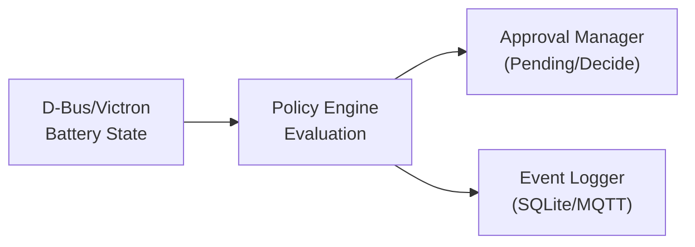

# Venus OS Governance

Policy engine with approval gates for Venus OS — SOC limits, charge/discharge rules, inverter control policies with audit logging via dbus-event-log.

## Features

- **Policy Engine**: Evaluate inverter actions against configurable policies
- **Approval Gates**: Require human/operator approval for critical actions
- **SOC Limits**: Configure min/max/critical SOC thresholds
- **D-Bus Integration**: Monitor Victron Venus OS battery/inverter state
- **Event Logging**: Audit trail via dbus-event-log (SQLite + MQTT)
- **CLI**: Command-line interface for evaluation and monitoring

## Installation

```bash
pip install -e .
```

## Usage

### Initialize Default Policies

```bash
venus-governance init
```

### Evaluate Policy

```bash
# Check if discharge at 15% SOC requires approval
venus-governance evaluate --action discharge --soc 15

# Check charge at 80% SOC
venus-governance evaluate --action charge --soc 80

# Full battery state
venus-governance evaluate --action discharge --soc 15 --voltage 48.0 --current -10.0 --power -480.0 --status discharging
```

### List Pending Approvals

```bash
venus-governance pending
```

### Decide on Approval Request

```bash
venus-governance decide <request-id> --decision approve --by operator --reason "Approved by on-call engineer"
```

### Start D-Bus Monitor

```bash
venus-governance monitor --host localhost --port 1883 --interval 5.0
```

### List Policies

```bash
venus-governance list-policies
```

### Query Governance Events

```bash
venus-governance events --db-path /var/lib/dbus-event-log/events.db --limit 100
```

## Default Policies

The default safety policy includes:

| Rule ID | Name | Action | Description |
|---------|------|--------|-------------|
| `critical-soc-emergency-stop` | Critical SOC Emergency Stop | DENY | Emergency stop all discharge at critical SOC (10%) |
| `no-discharge-below-20` | No Discharge Below 20% SOC | REQUIRE_APPROVAL | Prevent discharge below 20% SOC without approval |
| `external-control-gate` | External Control Gate | REQUIRE_APPROVAL | All external control changes require admin approval |
| `grid-feed-in-limit` | Grid Feed-in Limit | REQUIRE_APPROVAL | Require approval for grid feed-in |
| `no-charge-above-100` | No Charge Above 100% SOC | DENY | Prevent charge above 100% SOC |
| `log-all-actions` | Log All Actions | LOG_ONLY | Log all inverter actions for audit trail |

## Configuration

Policies are loaded from `config/policies/*.yaml`. Example:

```yaml
id: custom-policy
name: Custom Safety Policy
description: Custom policies for my setup
version: "1.0.0"
enabled: true
default_action: ALLOW
rules:
  - id: no-discharge-below-30
    name: No Discharge Below 30% SOC
    description: Stricter SOC limit for my battery
    enabled: true
    priority: 10
    inverter_action: DISCHARGE
    soc_threshold:
      min_soc: 30
      max_soc: 100
      critical_min_soc: 15
      warn_soc: 40
    soc_condition: min
    action: REQUIRE_APPROVAL
    approval_required: true
    approval_roles:
      - operator
      - admin
    approval_timeout_seconds: 300
    tags:
      - safety
      - soc-limit
```

## Architecture



## Integration

- **inverter-control**: Use policy engine to gate external control commands
- **dbus-event-log**: Audit all governance decisions
- **D-Bus**: Monitor real-time battery/inverter state on Venus OS

## Development

```bash
# Run tests
pytest tests/ -v

# Lint
ruff check src/

# Type check
mypy src/
```

## License

MIT